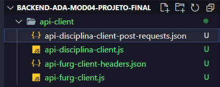
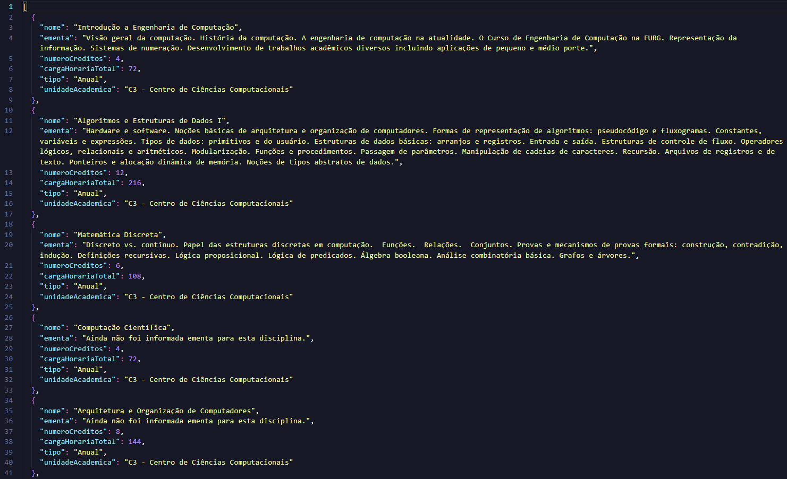
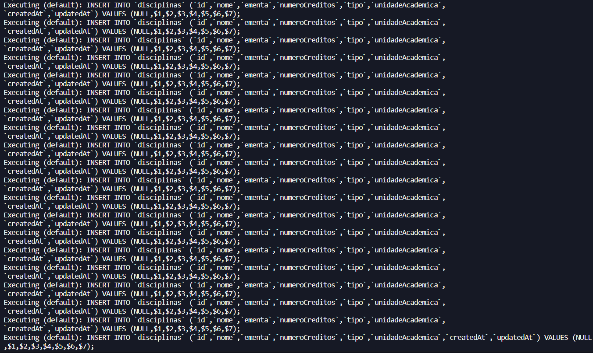
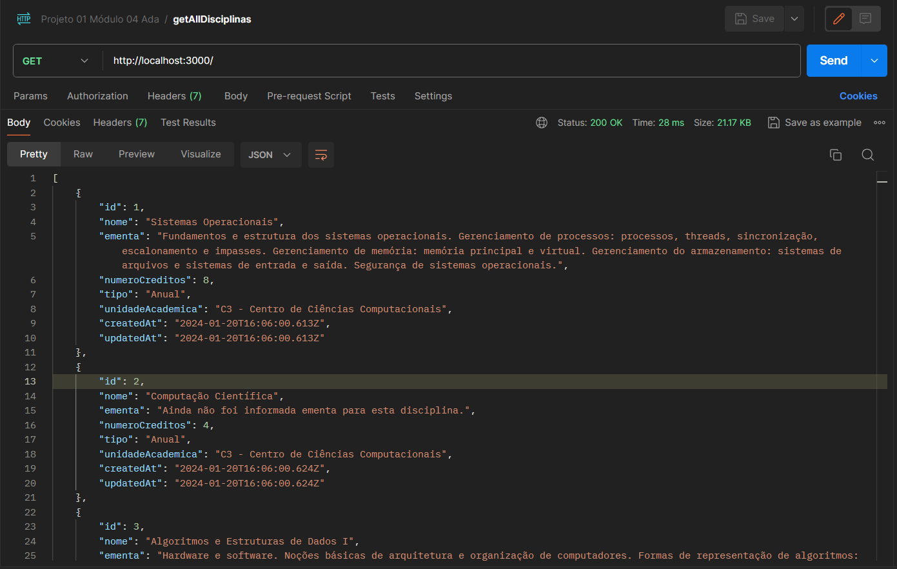
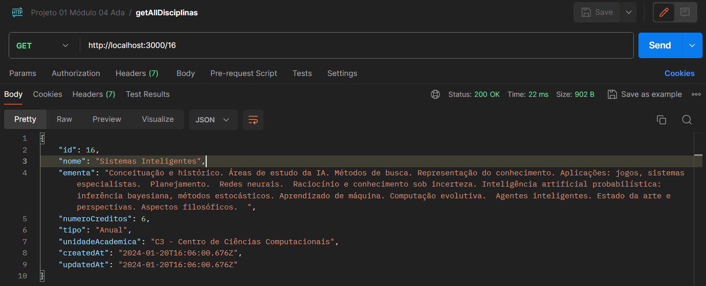

# Back-End Ada - Módulo 04 - Projeto final

#### Para clonar o projeto em sua máquina com HTTPS, execute:

```bash
git clone https://github.com/ailezigvilar/backend-ada-mod04-projeto-final.git
```

#### Para instalar as dependências do projeto, execute:

```bash
npm install express sequelize sqlite3 axios
```

#### Execução da aplicação

O fluxo correto de execução dos scripts é o seguinte:
1. Execute a aplicação principal com:
    ```bash
    node app.js
    ```
    Isso irá criar as tabelas, no caso da primeira execução, ou carregá-las novamente, caso seja uma nova execução. Além disso, isso também disponibiliza a aplicação na porta 3000, cujo endpoint de listagem pode ser acessado a partir do Postman ou mesmo com um curl como o do exemplo a seguir:
    ```bash
    curl -X GET http://localhost:3000
    ```

2. Entre na pasta api-client com:

    ```bash
    cd api-client
    ```
3. Execute a aplicação que consulta a API de disciplinas da FURG com:
    ```bash
    node api-furg-client.js
    ```
4. Isso irá criar o arquivo 'api-disciplina-client-post-requests.json':
    

    Este arquivo consome foi gerado a partir do consumo da API de disciplinas da FURG e traz os dados já devidamente formatados para serem utilizados na API desenvolvida:

    

5. Por fim, com a finalidade de validar o consumo da API desenvolvida com axios, pode-se executar a aplicação de consumo da API desenvolvida com:
    ```bash
    node api-disciplina-client.js
    ```

    Este aplicação executa 20 chamadas POST para a API de Disciplinas, desenvolvida neste projeto, cuja persistência de dados pode ser verificada tanto nos logs da aplicação:

    

    Quanto também pelo Postman, com o endpoint de getAllDisciplinas:

    

    Além disso, para ver um registro específico, basta chamar o endpoint de getById:

    

